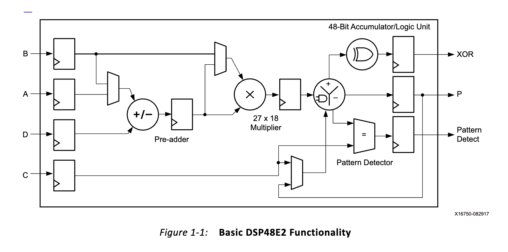

# Lakeroad and Churchroad Latch-Up 2025 Demo

This demo is meant to demonstrate the current state of the Lakeroad and Churchroad projects.

## Preliminary: Lakeroad and Churchroad

**Lakeroad** is a technology mapping subroutine which can be used to map designs to a *small number* of DSPs. Lakeroad relies on SMT solvers under the hood, which notoriously have scaling issues.

Lakeroad was first presented in [this paper](https://arxiv.org/abs/2401.16526), and was [presented at ASPLOS 2024.](https://www.youtube.com/watch?v=2XgOWAtJ8vs)

**Churchroad** is a more general technology mapper and can handle larger designs than Lakeroad. Churchroad uses multiple calls to Lakeroad under the hood, and in the future, will also incorporate other technology mapping methods.

Churchroad was first presented in [this workshop paper](https://arxiv.org/abs/2411.11036), and was [presented at WOSET 2024](https://www.youtube.com/watch?v=m8AwSktZeFE).

Lakeroad is currently more stable than Churchroad. Eventually, Churchroad will completely subsume Lakeroad.

## Introduction: What's the Issue?

Imagine you're building a hardware design targeting Xilinx UltraScale+ FPGAs. Your design includes the following hardware module:

[`./sub_mul.sv`](./sub_mul.sv):
```sv
module sub_mul(
  input clk,
	input  [15:0] a, b, d,
	output [15:0] out
);

	logic [31:0] stage0, stage1, stage2;

	always @(posedge clk) begin
	  stage0 <= (d - a) * b;
	  stage1 <= stage0;
	  stage2 <= stage1;
	end

	assign out = stage2;

endmodule
```

You'd like to map this module to the UltraScale+ DSP:



Rather than configuring the DSP yourself, you'd like to use Vivado to configure it automatically (a process often called "inference"). Thus, you run Vivado:

```sh
vivado -mode batch -source using_vivado/synth_script.tcl
```

However, when you go to map this design using Vivado, you find that it uses more than just a single DSP. See this table from the utilization report:

```
+----------+------+---------------------+
| Ref Name | Used | Functional Category |
+----------+------+---------------------+
| DSP48E2  |    2 |          Arithmetic |
+----------+------+---------------------+
```

An example of the full synthesized output can be seen at [`./vivado/vivado.out`](./vivado/vivado_out.sv).

Now what? Well, the only option at this point is to attempt to configure the DSP ourselves.

## Lakeroad

Lakeroad is a technology mapper for programmable hardware primitives, meant more completely use all features of primitives like DSPs. 

To use Lakeroad, download a release from its releases page:
https://github.com/gussmith23/lakeroad/releases

Unzip the release and set this environment variable, which is used by scripts down the road:
```sh
export LAKEROAD_DIR=<path to extracted lakeroad folder>
```

Add Lakeroad to your path:
```sh
export PATH="$LAKEROAD_DIR/bin:$PATH"
```

Now, you should have Lakeroad available for use:
```sh
which lakeroad
lakeroad --help
```

Lakeroad releases come with a few examples in `$LAKEROAD_DIR/examples`. 

### Using Lakeroad from the Command Line

To map our design using Lakeroad, we can use the following command:
```sh
lakeroad \
 --verilog-module-filepath example.sv \
 --top-module-name presubmul_3_stage_unsigned_16_bit \
 --architecture xilinx-ultrascale-plus \
 --template dsp \
 --initiation-interval 3 \
 --verilog-module-out-signal out:16 \
 --clock-name clk \
 --input-signal a:16 \
 --input-signal b:16 \
 --input-signal d:16 \
 --bitwuzla --stp --yices --cvc5 \
 --timeout 90 \
 --extra-cycles 2 \
 --out-format verilog \
 --module-name presubmul_3_stage_unsigned_16_bit
```


### Using Lakeroad via Yosys

#### Installing Yosys

Install locally with `PREFIX=$HOME/.local/`